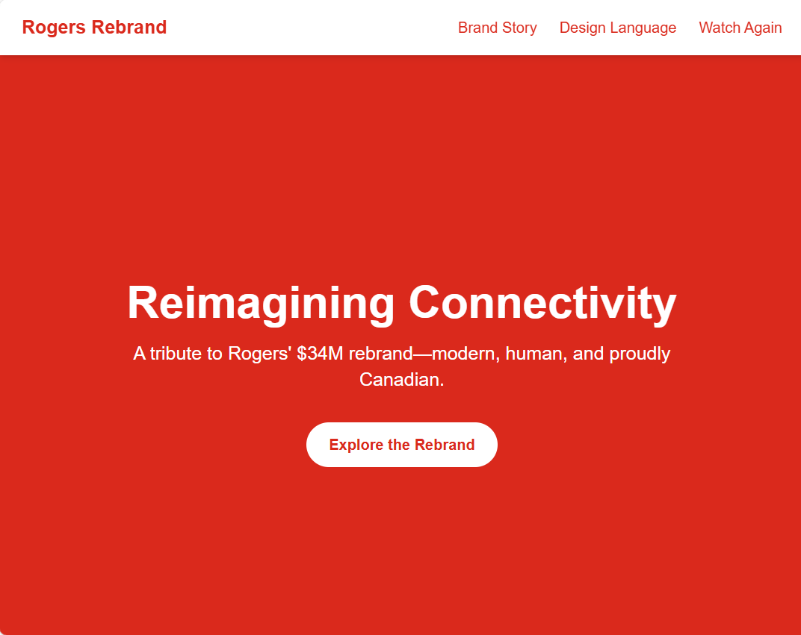

# Rogers Microsite

**Reimagining Connectivity**  
A tribute to Rogers’ $34M rebrand—modern, human, and proudly Canadian.

This microsite explores the brand story, design language, and visual identity behind Rogers’ transformation. Built with performance, clarity, and storytelling in mind.

---

## 🚀 Live Demo

- 🌐 [Vercel Deployment](https://rogers-microsite.vercel.app)
- 📄 [GitHub Pages](https://lgg6bentley.github.io/rogers-microsite) *(if applicable)*

---

## 🛠️ Tech Stack

- [Next.js](https://nextjs.org/) – React framework for production-grade apps  
- [Tailwind CSS](https://tailwindcss.com/) – Utility-first styling  
- [Vercel](https://vercel.com/) – Hosting and CI/CD  
- [GitHub](https://github.com/) – Version control and collaboration

---

## 📦 Features

- ⚡ Fast, responsive design
- 🎨 Modular components with consistent design language
- 🇨🇦 Branded storytelling with Canadian identity
- 🚀 Auto-deploys via Vercel on every push to `main`
- 📁 `.gitignore` configured to exclude `node_modules` and large binaries

---

## 📸 Preview

  
*Bold, modern, and proudly Canadian—this microsite celebrates Rogers’ $34M rebrand with immersive storytelling and sleek design.*

---

## 🧠 Inspiration

This project was inspired by Rogers’ bold rebranding initiative, which invested $34 million into redefining its identity. The microsite aims to reflect that same spirit—modern, human, and proudly Canadian.

---

## 📄 License

This project is open-source under the [MIT License](LICENSE).

---

## 🤝 Contributing

Pull requests are welcome! For major changes, please open an issue first to discuss what you’d like to change.

---

## 🙋‍♂️ Author

**Bentley**  
Mississauga, Ontario  
https://img.shields.io/badge/Made%20in%20Canada-FF0000?style=for-the-badge&logo=canada&logoColor=white
[GitHub Profile](https://github.com/lgg6bentley)

---
